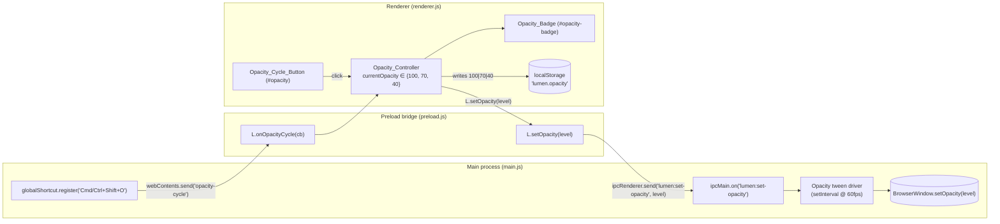

# Design Document

## Overview

This feature delivers three coordinated changes to Lumen's existing Electron app:

1. A user-controlled three-state Window_Opacity cycle (100% → 70% → 40% → 100%) driven by a new Opacity_Cycle_Button and a new global hotkey (`Cmd/Ctrl+Shift+O`). Window_Opacity is applied via `BrowserWindow.setOpacity` from the Main_Process so the entire overlay (chrome plus content) goes see-through.
2. A polish pass on the existing renderer: collapse the Settings_Panel by default, give every button a single shared visual language, attach native `title=` tooltips with the right modifier per platform, and group transcript actions into a Transcript_Action_Toolbar above the transcript text.
3. CSS-only animations: chat bubble fade-in, button hover transition, settings panel expand/collapse, typing indicator pulse, transcribing shimmer, and an eased opacity tween. All animations honor `prefers-reduced-motion: reduce`.

The work is intentionally scoped to surfaces already present in `renderer/index.html`, `renderer/renderer.js`, `main.js`, and `preload.js`. No new dependencies, no new permissions, no new network traffic. Privacy posture (`setContentProtection(true)`, BYOK keys in `localStorage`, lumen:// scheme) is preserved exactly.

### Source code anchors

The design references concrete code that already exists:

- `main.js` — `registerHotkeys()` (`globalShortcut.register` block), `ipcMain.on(...)` handlers, `BrowserWindow` construction with `setContentProtection(true)`, `setAlwaysOnTop(true, 'screen-saver')`, and `setVisibleOnAllWorkspaces(true, ...)`.
- `preload.js` — single `contextBridge.exposeInMainWorld('lumen', { ... })` block with `platform`, ipcRenderer-send shims, and ipcRenderer-on listener registrations.
- `renderer/index.html` — `<header class="title">` containing badges (`#eye`, `#ear`, `#ct-badge`, `#status`); `<details>` block titled "Backend settings" already wraps the backend/model/key controls; the transcript panel `#transcript-wrap` already exists and currently lays out actions in a single `.transcript-actions` row.
- `renderer/renderer.js` — module-scoped state at the top (`history`, `screenStream`, `listening`, `finalTranscript`, ...), helpers (`addMsg`, `setStatus`, `attachThumb`), DOM refs grabbed once via `$(id)`, and existing `…` placeholder injected by `addMsg('assistant', '…')` inside `ask()` and replaced when streamSSE/streamGemini/streamOllama set `target.textContent = ''`.

### Out of scope (explicit)

- Theme switcher, resizable panels, layout restructure, screenshot region select, multi-monitor handling, system-audio transcription, persistent chat history, animation libraries.
- Auto-triggering opacity changes from screen-share or click-through.

## Architecture

### High-level flow



### Process boundary

State of `currentOpacity` lives in the **renderer**, not the main process. Two reasons:

- `localStorage` is a renderer-only API; the persistence requirement (Req 4) lives where reading/writing localStorage is cheapest.
- The Opacity_Badge in the title bar (Req 3) is a renderer DOM node; keeping the source of truth co-located with the badge avoids a round-trip to refresh it on each cycle.

The hotkey, however, must live in the main process — `globalShortcut` is a main-process-only API. So when `Cmd/Ctrl+Shift+O` fires, the main process notifies the renderer via `webContents.send('opacity-cycle')`. The renderer's `cycleOpacity()` function is the single chokepoint, called from both the click handler and the hotkey listener — this guarantees the cycle, persistence, badge, and IPC dispatch all stay in sync regardless of which trigger fired.

**Alternative considered**: keep `currentOpacity` in main and have the renderer read it via IPC on init. Rejected: it duplicates the persistence story (main would need to read/write a JSON file in `userData`, while localStorage already exists), and forces an extra IPC round-trip on every badge refresh.

### Smooth opacity tween

Electron's `BrowserWindow.setOpacity(level)` applies instantly. To satisfy Req 6 (150–300 ms eased transition at ≥30 fps), the tween is driven from **main.js** because the renderer cannot call `setOpacity` directly. The renderer sends a single target level; the main process interpolates locally.

Approach: 12 frames over ~200 ms (≈60 fps), `setInterval(stepFn, 16)`, ease-out cubic. Pseudocode:

```text
on ipc 'lumen:set-opacity'(target):
  if reducedMotion or current == target:
    setOpacity(target); return
  cancel any in-progress tween
  start := current
  steps := 12
  durationMs := 200
  i := 0
  timer := setInterval(() => {
    i += 1
    t := i / steps                       // 0 → 1
    eased := 1 - (1 - t)^3               // ease-out cubic
    next := start + (target - start) * eased
    setOpacity(next)
    if i >= steps:
      clearInterval(timer)
      setOpacity(target)                 // snap to exact target
  }, durationMs / steps)
```

The main process learns about `prefers-reduced-motion: reduce` via the renderer: when `Opacity_Controller.setOpacity(level)` calls `L.setOpacity(level, { instant })`, it passes `instant: true` if the media query matches. Main receives the flag and bypasses the tween (Req 15.6).

This is a non-obvious choice and worth flagging clearly: **a CSS opacity transition on `body` does not work**, because Req 1.6 mandates `BrowserWindow.setOpacity` on the entire window (which dims the chrome and the content together — exactly what "see-through" means here). CSS `opacity` on the body would only dim the content and leave the title bar opaque, which fails the visual goal.

### Settings panel collapse mechanism

The `<details>` element is already present in `index.html`. The native `<details>` open/close transition is unreliable across engines (Chromium specifically does not animate the height of `<details>` content). Two options were considered:

- **(a)** Style `details[open]` with a CSS height transition. Fails because `<details>` content is `display: none` when closed and `display: block` when open — there's no animatable height anchor.
- **(b)** **(chosen)** Replace the implicit toggle with a JS-managed class. We keep `<details>` for accessibility (the disclosure semantics are baked in), but swap the default toggle behavior:
  - Cancel the native toggle on `summary` click via `e.preventDefault()`.
  - Toggle a `.expanded` class on the `<details>` element instead.
  - Animate `max-height` from `0` to a generous value (e.g. `360px`) plus `opacity` from `0` to `1` over 200–300 ms (Req 7.5).

Justification: option (b) gives smooth, eased animation in both directions, works in Electron's Chromium, and keeps native disclosure semantics for screen readers when we sync `aria-expanded` on the summary.

Persistence: the user's expanded preference is written to `localStorage['lumen.settings.expanded']` as the string `"true"` or `"false"`. On init, if the key is missing the panel stays collapsed (Req 7.1). If the key holds anything other than `"true"` or `"false"`, the panel stays collapsed and the value is rewritten to `"false"`.

### Button visual language

A single `.btn` class is added with shared styles for the four interaction states. Every existing button in the command and transcript panels gets the class added (it composes with the existing `.ghost` and `.primary` classes — `.primary` keeps the accent fill and bold weight, `.ghost` keeps the transparent background, and `.btn` provides the shared border-radius, hover transition, active treatment, and disabled treatment).

State map:

| State | Treatment |
|---|---|
| Inactive | `border: 1px solid var(--border)`, `background: transparent` (or accent for `.primary`), `color: var(--fg)`. |
| Hover | `background: var(--code-bg)` (or +6% accent for `.primary`); `transition: background-color 200ms ease, border-color 200ms ease`. |
| Active (toggled-on) | `background: rgba(255,107,107,0.12)`, `border-color: rgba(255,107,107,0.4)`, `color: #ffb3b3`, plus the existing `::before` red-dot prefix. Triggered by the `.active` class already used on Listen_Button / Share_Screen_Button. The new Opacity_Cycle_Button does **not** use the active state — it has no on/off semantic, only a label that changes between "100%", "70%", "40%". |
| Disabled | `opacity: 0.5`, `cursor: not-allowed`, hover transition suppressed via `&:disabled:hover { background: transparent }`. |

Existing button-id list these styles apply to (Req 8.1):

- `#listen` (Listen_Button) — toggles `.active` from `updateListenUI()`.
- `#share` (Share_Screen_Button) — toggles `.active` from `toggleScreen()` / `stopScreen()`.
- `#send` (Send_Button) — `.primary`, never gets `.active`.
- `#clear` (Clear_Chat_Button) — `.ghost`.
- `#savekey` (Save_Key_Button), `#clearkey` (Forget_Key_Button), `#ping` (Check_Connection_Button) — `.ghost`.
- `#transcript-use` (Use_As_Prompt_Button), `#transcript-append` (Append_To_Prompt_Button), `#transcript-clear` (Clear_Transcript_Button) — `.ghost`.
- `#opacity` (Opacity_Cycle_Button, new) — `.ghost`.

### Native title tooltips

`title=` is set at renderer init time, not in the static HTML, because the modifier label depends on platform (Req 9.1, 9.2) and `L.platform` is only available after preload runs. The renderer detects platform via the existing `L.platform` (already exported from `preload.js`):

```text
const mod = L.platform === 'darwin' ? 'Cmd' : 'Ctrl';
sendBtn.title       = `Send (${mod}+Enter)`;
opacityBtn.title    = `Cycle opacity (${mod}+Shift+O)`;
listenBtn.title     = 'Toggle microphone listening (Whisper)';
shareBtn.title      = 'Toggle screen sharing';
clearBtn.title      = 'Clear chat history';
savekeyBtn.title    = 'Save API key to local storage';
clearkeyBtn.title   = 'Remove the saved API key';
pingBtn.title       = 'Check connection to the selected backend';
transcriptUse.title    = 'Replace the input with the current transcript';
transcriptAppend.title = 'Append the current transcript to the input';
transcriptClear.title  = 'Clear the current transcript';
```

Title is set via `element.title = '...'` once at module init. This satisfies Req 9 without any tooltip library (Req 9.4).

### Transcript_Action_Toolbar

Markup change in `index.html`: the existing `<div class="transcript-actions">` row already groups the three buttons but sits **below** the transcript text. Two changes:

1. Move the `.transcript-actions` div above `#transcript-text` in the DOM (Req 10.2).
2. Rename it to `.transcript-toolbar` and add CSS to apply a bottom divider rule and slightly different background (Req 10.3):

```text
.transcript-toolbar {
  display: flex; gap: 6px; align-items: center;
  padding: 4px 6px;
  background: rgba(255,255,255,0.02);
  border-bottom: 1px solid var(--border);
}
```

### Animations summary

| Animation | Trigger | Mechanism | Duration | Disabled by reduced-motion |
|---|---|---|---|---|
| Chat bubble fade-in | New `.msg` appended via `addMsg()` | `@keyframes fadeIn` applied to `.msg` (`animation: fadeIn 250ms ease-out;`) | 200–300 ms | Yes (Req 15.1) |
| Button hover | Pointer over any `.btn` | `transition: background-color 200ms ease, border-color 200ms ease` on `.btn` | 150–300 ms | Yes (Req 15.3) |
| Settings expand/collapse | `details.expanded` class toggled via JS | `transition: max-height 250ms ease, opacity 250ms ease` on a wrapper inside `<details>` | 200–300 ms | Yes (Req 15.2) |
| Typing indicator pulse | Assistant bubble awaiting first token | `@keyframes pulse` on `.typing` (three dots, staggered animation-delay) | 1 s loop | Yes (Req 15.4) |
| Transcribing shimmer | Status text equals `transcribing…` | `@keyframes shimmer` on `#transcript-text.shimmer` (linear-gradient background-position sweep) | 1.5 s loop | Yes (Req 15.5) |
| Opacity tween | Window_Opacity changes | Main-process `setInterval` driver, ease-out cubic over 12 frames ≈ 200 ms | 150–300 ms | Yes (Req 15.6) — instant set when reduced-motion is set |

`prefers-reduced-motion: reduce` is honored via a single block at the bottom of the stylesheet:

```text
@media (prefers-reduced-motion: reduce) {
  .msg                      { animation: none !important; }
  .btn                      { transition: none !important; }
  details .settings-body    { transition: none !important; }
  .typing, .typing-dot      { animation: none !important; }
  #transcript-text.shimmer  { animation: none !important; background: var(--bg); }
}
```

The renderer also reads `window.matchMedia('(prefers-reduced-motion: reduce)').matches` to forward an `instant` flag through `L.setOpacity(level, { instant })` (Req 15.6, 15.7). State changes still occur — only the animated transitions are suppressed.

### Status_Line driver hook

`setStatus(text, ok)` already exists. To wire the transcribing shimmer (Req 14), extend it minimally:

```text
function setStatus(s, ok) {
  statusEl.textContent = s;
  statusEl.style.color = ok ? 'var(--ok)' : 'var(--muted)';
  // Toggle the shimmer class on the transcript text panel to mirror status.
  if (transcriptText) {
    transcriptText.classList.toggle('shimmer', s === 'transcribing…');
  }
}
```

This is the entirety of the wiring — `updateStatusLine()` already drives `setStatus('transcribing…', true)` whenever `inFlight > 0` and `setStatus('listening…', true)` otherwise. No new state machine.

### Typing_Indicator

Today, `ask()` calls `addMsg('assistant', '…')` and the streamers later call `target.textContent = ''` when the first token arrives. Replace the literal `…` placeholder with a small DOM fragment carrying the `.typing` class (three dots with staggered animation-delay):

```text
function addAssistantPlaceholder() {
  const d = document.createElement('div');
  d.className = 'msg assistant';
  const t = document.createElement('span');
  t.className = 'typing';
  t.innerHTML = '<span class="typing-dot"></span><span class="typing-dot"></span><span class="typing-dot"></span>';
  d.appendChild(t);
  chat.appendChild(d);
  chat.scrollTop = chat.scrollHeight;
  return d;
}
```

The existing `target.textContent = ''` calls in `streamSSE`, `streamGemini`, and `streamOllama` already replace the bubble's contents on first token, which removes the indicator (Req 13.3) without further changes.

### Coexistence with content protection / click-through / always-on-top

Confirmed by reading `main.js`:

- `BrowserWindow.setOpacity` does not interact with `setContentProtection(true)`. Content protection is a Cocoa `NSWindow.sharingType` flag (macOS) and `WDA_EXCLUDEFROMCAPTURE` (Windows). Both apply at the OS compositor layer above the alpha channel. So at 70% or 40% opacity the window remains hidden from screen capture (Req 17.1).
- `setIgnoreMouseEvents(clickThrough, { forward: true })` is independent of opacity — these are orthogonal axes. Toggling click-through does not change opacity, and changing opacity does not change click-through (Req 17.2).
- `setOpacity` does not move the window, change its size, change always-on-top status, or change visible-on-all-workspaces. Position, size, `setAlwaysOnTop(true, 'screen-saver')`, and `setVisibleOnAllWorkspaces(true, { visibleOnFullScreen: true })` survive (Req 17.3).

## Components and Interfaces

### Main_Process (`main.js`)

#### New IPC handler

```text
let opacityTweenTimer = null;
let currentWindowOpacity = 1.0;

ipcMain.on('lumen:set-opacity', (_evt, payload) => {
  if (!win) return;
  const target = clampOpacity(payload && payload.level);   // map 100→1.0, 70→0.7, 40→0.4
  const instant = !!(payload && payload.instant);
  if (opacityTweenTimer) { clearInterval(opacityTweenTimer); opacityTweenTimer = null; }
  if (instant || target === currentWindowOpacity) {
    win.setOpacity(target);
    currentWindowOpacity = target;
    return;
  }
  const start = currentWindowOpacity;
  const steps = 12;
  let i = 0;
  opacityTweenTimer = setInterval(() => {
    i += 1;
    const t = i / steps;
    const eased = 1 - Math.pow(1 - t, 3);
    const next = start + (target - start) * eased;
    if (win) win.setOpacity(next);
    if (i >= steps) {
      clearInterval(opacityTweenTimer);
      opacityTweenTimer = null;
      if (win) win.setOpacity(target);
      currentWindowOpacity = target;
    }
  }, 200 / steps);   // ≈16.6 ms per step
});
```

`clampOpacity(level)` accepts only the literal numbers 100, 70, 40 and returns 1.0, 0.7, 0.4 respectively; any other value returns 1.0 (defense in depth — the renderer's controller is the source of truth, but main never trusts the wire payload blindly).

#### New global hotkey

Inside `registerHotkeys()`, append one binding to the existing `bindings` object:

```text
'CommandOrControl+Shift+O': () => {
  if (win) win.webContents.send('opacity-cycle');
},
```

The existing failure path (Req 2.5) is reused: `globalShortcut.register` returns false on collision/failure, the loop pushes the failing chord into `failed[]`, and `console.warn('[lumen] could not register: ...')` runs. Application startup continues.

Collision check (Req 2.4): the existing chords are `Space`, `L`, `T`, `Up`, `Down`, `Left`, `Right` under `CommandOrControl+Shift+`. `O` does not collide. macOS Mission Control reserves `Ctrl+Up/Down`, but those are not Cmd-shifted; `Cmd+Shift+O` is unbound by default in macOS (the system-level "Open" shortcut is plain `Cmd+O` and lives in the foreground app, not as a global). On Windows/Linux `Ctrl+Shift+O` is similarly unbound at the desktop level. We accept the small risk that a user has rebound it in their OS — Req 2.5 covers that case with a warning.

### Preload bridge (`preload.js`)

Two additions to the `contextBridge.exposeInMainWorld('lumen', { ... })` object:

```text
setOpacity: (level, opts) => ipcRenderer.send('lumen:set-opacity', { level, instant: !!(opts && opts.instant) }),
onOpacityCycle: (cb) => ipcRenderer.on('opacity-cycle', () => cb()),
```

`setOpacity(level)` accepts 100, 70, or 40; the renderer never passes anything else. `onOpacityCycle(cb)` registers a single listener; the renderer wires it once at module init.

### Renderer (`renderer/renderer.js`)

#### Opacity_Controller (new module-scoped block)

Inserted near the top of the file alongside the other module-scoped state, after the existing `let listening = false;` line:

```text
// ── Opacity_Controller ───────────────────────────────────────────────────────
const OPACITY_LEVELS = [100, 70, 40];          // valid set; cycle order
const OPACITY_KEY = 'lumen.opacity';
let currentOpacity = 100;                       // mirrored in localStorage on every change

function loadOpacity() {
  const raw = localStorage.getItem(OPACITY_KEY);
  if (raw === '100' || raw === '70' || raw === '40') return Number(raw);
  // Missing or malformed → 100 and overwrite (Req 4.3, 4.4).
  localStorage.setItem(OPACITY_KEY, '100');
  return 100;
}

function setOpacity(level) {
  if (!OPACITY_LEVELS.includes(level)) return;  // defensive; no-op on bad input
  currentOpacity = level;
  localStorage.setItem(OPACITY_KEY, String(level));
  updateOpacityBadge();
  const reduced = window.matchMedia('(prefers-reduced-motion: reduce)').matches;
  L.setOpacity(level, { instant: reduced });
}

function cycleOpacity() {
  const i = OPACITY_LEVELS.indexOf(currentOpacity);
  const next = OPACITY_LEVELS[(i + 1) % OPACITY_LEVELS.length];   // 100→70→40→100
  setOpacity(next);
}

function updateOpacityBadge() {
  if (!opacityBadge) return;
  opacityBadge.textContent = currentOpacity + '%';
}
```

Init wiring (added below the existing `L.onFocusInput(...)` / `L.onClickThroughChange(...)` block):

```text
// On boot: load persisted level and apply it (Req 4.2).
currentOpacity = loadOpacity();
updateOpacityBadge();
L.setOpacity(currentOpacity, { instant: true });    // no animation on first paint

// Wire button + hotkey to the same chokepoint.
opacityBtn.addEventListener('click', cycleOpacity);
L.onOpacityCycle(cycleOpacity);
```

The single chokepoint guarantee: button click and hotkey both call `cycleOpacity()`, which calls `setOpacity()`, which writes localStorage, updates the badge, and dispatches IPC. Req 5 (no auto-cycle from screen-share/click-through/Whisper) is satisfied by the absence of any other caller — the controller has no listeners on `toggleScreen`, `setIgnoreMouseEvents`, or `startWhisper`/`stopWhisper`.

#### Settings_Panel collapse handler

Added near the existing event-listener block:

```text
const SETTINGS_KEY = 'lumen.settings.expanded';
const settingsDetails = document.querySelector('.cmd > details');
const settingsSummary = settingsDetails.querySelector('summary');

function loadSettingsExpanded() {
  const raw = localStorage.getItem(SETTINGS_KEY);
  if (raw === 'true') return true;
  if (raw === 'false') return false;
  // Missing or malformed → collapsed and overwrite (Req 7.1).
  localStorage.setItem(SETTINGS_KEY, 'false');
  return false;
}

function applySettingsExpanded(expanded) {
  settingsDetails.classList.toggle('expanded', expanded);
  settingsSummary.setAttribute('aria-expanded', expanded ? 'true' : 'false');
  localStorage.setItem(SETTINGS_KEY, expanded ? 'true' : 'false');
}

settingsSummary.addEventListener('click', (e) => {
  e.preventDefault();   // cancel native toggle; our class drives the animation
  const next = !settingsDetails.classList.contains('expanded');
  applySettingsExpanded(next);
});

applySettingsExpanded(loadSettingsExpanded());
```

#### `setStatus` extension

The single line addition described in the Status_Line driver hook section above. No other changes to existing helpers.

### Renderer markup (`renderer/index.html`)

Three changes:

1. **Opacity_Badge** in the title bar — add alongside `#eye`/`#ear`:
   ```html
   <span id="opacity-badge" class="badge nodrag" title="Window opacity">100%</span>
   ```
2. **Opacity_Cycle_Button** in the action row at the bottom of the command panel, between Listen_Button and Clear_Chat_Button:
   ```html
   <button class="ghost btn" id="opacity">100%</button>
   ```
   (Label is updated on every cycle to mirror `currentOpacity`.)
3. **Transcript_Action_Toolbar** — wrap the three transcript action buttons in a div with class `transcript-toolbar` and **move it above** `#transcript-text` (currently below). The existing `.transcript-actions` class is renamed to `.transcript-toolbar`.

The existing `<details>` already has the right structure for Settings_Panel — we wrap its body content in a single `<div class="settings-body">` so the JS-toggled height transition has a clean target.

All buttons get `class="btn"` added (composing with their existing `.ghost` or `.primary` class). All buttons get `title=` set at init time by JS, not in the HTML, so the platform-aware modifier works.

## Data Models

### Window_Opacity

```text
type OpacityLevel = 100 | 70 | 40
type OpacityFraction = 1.0 | 0.7 | 0.4   // what BrowserWindow.setOpacity sees

OPACITY_LEVELS: OpacityLevel[] = [100, 70, 40]   // fixed cycle order
levelToFraction: { 100 → 1.0, 70 → 0.7, 40 → 0.4 }
```

Storage:

| Key | Owner | Type | Default | Valid values |
|---|---|---|---|---|
| `localStorage['lumen.opacity']` | Renderer | string | `"100"` | `"100"`, `"70"`, `"40"` |
| `localStorage['lumen.settings.expanded']` | Renderer | string | `"false"` | `"true"`, `"false"` |

Wire format (renderer → main IPC):

```text
ipcMain channel: 'lumen:set-opacity'
payload: { level: 100 | 70 | 40, instant: boolean }
```

Wire format (main → renderer IPC):

```text
webContents channel: 'opacity-cycle'
payload: () => void   // no body; the renderer's cycleOpacity() handles state
```

### Settings_Panel state

```text
type SettingsExpanded = boolean
storage key: 'lumen.settings.expanded'
```

### Animation state (transient, in-memory only)

- `details.expanded` class on the `<details>` element drives the height/opacity transition.
- `#transcript-text.shimmer` class drives the shimmer keyframe; toggled inside `setStatus()`.
- `.typing` element inside the assistant bubble drives the pulse; removed by the existing `target.textContent = ''` calls in the streamers.

No other persistent state is added.

## Correctness Properties

*A property is a characteristic or behavior that should hold true across all valid executions of a system — essentially, a formal statement about what the system should do. Properties serve as the bridge between human-readable specifications and machine-verifiable correctness guarantees.*

The Opacity_Controller is a small pure state machine over a fixed three-element cycle, with persistence to localStorage. That makes it a natural fit for property-based testing: the input space (sequences of cycle activations × stored localStorage values) is large, and universal invariants are easy to state. The animation and visual-polish work, in contrast, is CSS-driven and reduced-motion-aware — those go through example-based tests and a `matchMedia` mock.

### Property 1: Opacity stays in the valid set under any cycle sequence

*For any* sequence of cycle activations (button click, hotkey, or any interleaving) starting from any valid initial `currentOpacity`, after every cycle `currentOpacity` ∈ {100, 70, 40}, and the transition follows the order 100 → 70 → 40 → 100.

**Validates: Requirements 1.2, 1.3, 1.4, 1.5, 2.3**

### Property 2: Opacity persists across renderer reload

*For any* sequence of cycle activations followed by a simulated renderer reload (re-running `loadOpacity()` against the same localStorage), the loaded opacity equals the last value applied by `setOpacity()`.

**Validates: Requirements 4.1, 4.2**

### Property 3: `loadOpacity()` is corruption-safe

*For any* string value present in `localStorage['lumen.opacity']` (including missing key, empty string, whitespace, very long strings, non-numeric, numeric-but-out-of-set values like `"50"` or `"-1"`), `loadOpacity()` returns 100 unless the value is exactly `"100"`, `"70"`, or `"40"`. When the value is rejected, localStorage is overwritten with `"100"`.

**Validates: Requirements 4.3, 4.4**

### Property 4: Unrelated state changes do not move opacity

*For any* sequence of mock toggles of screen sharing, click-through, and Whisper start/stop — interleaved with no cycle activations — `currentOpacity` and the persisted `localStorage['lumen.opacity']` remain at their initial values.

**Validates: Requirements 5.1, 5.2, 5.3, 5.4**

### Property 5: Settings panel collapse persists

*For any* sequence of expand/collapse toggles of the Settings_Panel, `localStorage['lumen.settings.expanded']` after each toggle equals `"true"` if the panel is currently expanded and `"false"` otherwise; loading a fresh renderer with that storage value applies the matching `details.expanded` class.

**Validates: Requirements 7.1, 7.2**

## Error Handling

### Hotkey registration failure (Req 2.5)

The existing `registerHotkeys()` loop already collects failures and emits `console.warn('[lumen] could not register: ...')`. The new opacity binding plugs into that same loop and inherits the behavior — no new error path.

### IPC payload validation in main

`ipcMain.on('lumen:set-opacity')` runs `clampOpacity()` on the incoming `level`. Any value other than 100, 70, or 40 is treated as 100 and applied instantly with no tween. The renderer never sends bad values, but main does not trust the wire.

### Corrupt localStorage (Req 4.3, 4.4)

`loadOpacity()` is the only reader. It accepts only the three exact strings `"100"`, `"70"`, `"40"`. Anything else (missing key, malformed JSON-ish blob, integer outside the set, whitespace, very long strings) is normalized to 100 and the storage is overwritten. The same defensive pattern is applied to `loadSettingsExpanded()`.

### Reduced-motion preference

If `window.matchMedia('(prefers-reduced-motion: reduce)').matches` is true at the moment a cycle happens, the renderer passes `instant: true` over IPC and the main process skips the tween. The state change still takes effect (Req 15.7) — the user just sees an instant set.

This pattern is also applied at module init: the very first `L.setOpacity(currentOpacity, { instant: true })` call always runs instant, regardless of the media query, because no animation makes sense on initial paint.

### Window destroyed mid-tween

The tween timer in main checks `if (win)` before calling `win.setOpacity(...)`. If the window is destroyed while a tween is running, the timer either no-ops or completes harmlessly. On `app.will-quit`, `globalShortcut.unregisterAll()` already runs; we do not need an explicit `clearInterval` because the process is shutting down.

### No new permission prompts (Req 16.5)

The opacity feature uses no Web APIs that trigger permission prompts. Setting `BrowserWindow.setOpacity` does not require any OS permission. The `prefers-reduced-motion` media query is read via `matchMedia`, which is also permission-free.

## Testing Strategy

### Approach

The Opacity_Controller is a small pure state machine. Rather than extending `whisperHarness.js` (which is heavy with Whisper-specific mocks), we add a **new tiny pure module** `tests/opacityHarness.js` that mirrors the controller's logic without DOM or Electron, plus a `localStorage` shim modeled after the one in `whisperHarness.js`. The renderer's actual `Opacity_Controller` block (the `loadOpacity` / `setOpacity` / `cycleOpacity` functions) is small enough to be hoisted — for unit tests we shim `window.matchMedia` and `L.setOpacity` and call the renderer functions directly via a tiny module wrapper.

The polish/animation work is example-tested: render the static markup, snapshot the relevant attributes, exercise the toggle handlers, mock `matchMedia` to flip reduced-motion on/off and verify the class state.

### Property tests (using fast-check, already in `devDependencies`)

| Property | Generator | Assertion |
|---|---|---|
| P1 | array of arbitrary length up to 100 of "cycle" actions; arbitrary initial opacity ∈ {100, 70, 40} | After each action, `currentOpacity ∈ {100, 70, 40}`; the sequence of values follows 100→70→40→100. |
| P2 | same generator as P1 | After the last action, `loadOpacity()` reading the same localStorage returns `currentOpacity`. |
| P3 | arbitrary string (including unicode, empty, whitespace, very long) seeded into `localStorage['lumen.opacity']` | `loadOpacity()` returns 100 unless the seed is exactly `"100"`/`"70"`/`"40"`; if rejected, storage is overwritten with `"100"`. |
| P4 | array of arbitrary "screen-share toggle" / "click-through toggle" / "whisper start" / "whisper stop" actions, **no cycle actions** | `currentOpacity` and `localStorage['lumen.opacity']` are unchanged from initial. (Implementation: the harness exposes mock versions of `toggleScreen`, `setIgnoreMouseEvents`, `startWhisper`, `stopWhisper` as no-ops on the controller — which is the point: there are no listeners to fire.) |
| P5 | array of arbitrary toggle actions; arbitrary initial expanded boolean | After each toggle, `localStorage['lumen.settings.expanded']` matches the current expanded state; loading the harness fresh against that storage applies the same expanded class. |

Each property test runs the standard 100 iterations (fast-check default), and each test file is tagged with comment headers in the format **Feature: ui-polish-and-see-through, Property N: <text>**.

### Unit tests (Vitest, matches existing `tests/whisperUnits.test.js` style)

- **Hotkey collision**: parse the hotkey list in `registerHotkeys()` (or import from a small extracted constants module), assert that `CommandOrControl+Shift+O` is present and is unique against the existing chord set (Req 2.4).
- **Settings panel persistence on init**: seed `localStorage` with `"true"` / `"false"` / missing / `"yes"` / `""`, instantiate the harness, assert the resulting expanded class state and the rewritten storage value.
- **Button title attribute generation**: stub `L.platform = 'darwin'` then `'win32'`, run the title-init helper, assert each button's `title` contains the right modifier ("Cmd+" vs "Ctrl+") for Send_Button and Opacity_Cycle_Button (Req 9.1, 9.2), and contains a plain-English description for the rest (Req 9.3).
- **Reduced-motion handling**: mock `window.matchMedia('(prefers-reduced-motion: reduce)')` to return `{ matches: true }`, call `setOpacity(70)`, assert the `L.setOpacity` mock was called with `{ instant: true }` (Req 15.6); then with `{ matches: false }` and assert `instant: false` (Req 15.7 — state still changes).
- **`setStatus` shimmer toggle**: render a fake `#transcript-text` element, call `setStatus('transcribing…', true)` then `setStatus('listening…', true)`, assert the `shimmer` class is added then removed (Req 14.1, 14.2).
- **Typing indicator removal**: call `addAssistantPlaceholder()`, assert the `.typing` element is present; then set `target.textContent = ''` (simulating first streamed token), assert the `.typing` element is gone within the next microtask (Req 13.3 — happens synchronously, well under 100 ms).
- **`loadOpacity` overwrite**: when the stored value is corrupt, calling `loadOpacity()` writes `"100"` back to the storage (read this back via the localStorage shim).

### Manual end-to-end checklist

These are inherently visual and hardware-dependent, so they live as a checklist in `MIC-FIX-TESTING.md`-style markdown (a new `UI-POLISH-TESTING.md`):

1. Run `npm start`. Confirm Settings_Panel is collapsed by default; click summary; confirm 200–300 ms eased expand.
2. Click Opacity_Cycle_Button; confirm the badge in the title bar updates to "70%" within 100 ms; confirm the entire window dims smoothly. Click again; confirm 40%. Click again; confirm 100%.
3. Press `Cmd+Shift+O` (mac) / `Ctrl+Shift+O` (win/linux). Confirm same cycle.
4. Set OS-level "Reduce motion" (macOS: System Settings → Accessibility → Display → Reduce Motion). Cycle opacity again; confirm instant (no tween). Toggle settings panel; confirm instant (no animation).
5. Quit and relaunch. Confirm the badge returns to whatever level was set last; confirm settings panel returns to whatever expanded state was last.
6. Start screen sharing. Confirm opacity badge does not change. Toggle click-through with `Cmd+Shift+T`. Confirm opacity badge does not change. Start Whisper. Confirm opacity badge does not change.
7. Ask a question; observe the typing indicator pulse before the first token, the chat bubble fade-in on append, and the transcribing shimmer when chunks are uploading.
8. Hover each button; confirm the hover transition feels consistent and smooth across all 11 buttons.
9. Hover each button without clicking; confirm a native OS tooltip appears within ~1 second showing the action and (where applicable) the platform-correct modifier.
10. Set Window_Opacity to 70%, take a screenshot via OS screenshot tool, confirm the Lumen window is excluded from the screenshot (content-protection still works at reduced opacity, Req 17.1).
