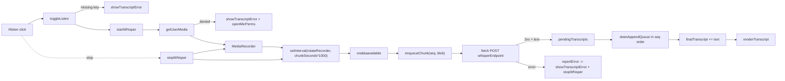

# Design Document — Whisper Mic Transcription

## Overview

Lumen's mic transcription currently runs on the browser-internal Web Speech API. After the `mic-transcription-broken` bugfix, the renderer loads from the secure custom `lumen://` origin and the Web Speech `onerror` / `onend` handlers carry a bounded restart-policy state machine (`MAX_ERROR_RESTARTS`, `MIN_CLEAN_SESSION_MS`, `consecutiveErrorRestarts`, `lastSessionStartedAt`, `lastError`). The bounded loop and the user-visible error are working, but the underlying chunked upload to Google's speech endpoint still fails because Electron's Chromium ships without the Google-internal API key Web Speech needs. No transcripts are produced.

This feature replaces the Web Speech path with a `Whisper_Client` that captures mic audio with `MediaRecorder`, slices it into fixed-duration chunks, and POSTs each chunk to an OpenAI-compatible Whisper endpoint (default Groq `https://api.groq.com/openai/v1/audio/transcriptions`, model `whisper-large-v3`). The user-visible mic surface — the `🎤 Listen` button (`#listen`), the transcript panel (`#transcript-text`, `#transcript-wrap`), the prompt-injection actions (`Use as prompt`, `Append to prompt`, `Clear`), and the macOS mic-permission deep-link — is unchanged. The renderer's helpers `showTranscriptError`, `renderTranscript`, and `updateListenUI` are kept; the Web Speech wiring and its restart-policy state are retired.

The change is renderer-only. `main.js` and `preload.js` need no edits: the `lumen://` origin already gives `MediaRecorder` and `fetch` a real, secure document context, and `L.openMicPerms()` already exists for the macOS permission deep-link.

## Architecture

### Where the Whisper_Client lives in the renderer

`renderer/renderer.js` is a single flat module. The Whisper_Client replaces the `// MIC LISTENING (Web Speech API)` section (currently lines 138–249 of `renderer.js`, encompassing `setupRecognition`, `toggleListen`, the SpeechRecognition `onresult`/`onerror`/`onend` handlers, and the restart-policy state). The new `// MIC LISTENING (Whisper)` section sits in the same place and reuses the same DOM refs, the same `L.openMicPerms()` bridge, and the same `currentKey()` / `localStorage` conventions used by `streamGroq`.

The Whisper_Client is structured as a small set of module-scoped state variables and a handful of pure-ish helpers, in the same flat style as the existing `streamGroq` / `streamGemini` / `streamOllama` functions. There is no class, no module split — this matches the existing codebase shape.

### Module-scoped state (replaces Web Speech state)

Removed (currently in `renderer.js` around lines 28–40):
- `let recognition = null;`
- `const MAX_ERROR_RESTARTS = 3;`
- `const MIN_CLEAN_SESSION_MS = 1000;`
- `let consecutiveErrorRestarts = 0;`
- `let lastSessionStartedAt = 0;`
- `let lastError = null;`

Kept:
- `let listening = false;` (now driven by Whisper_Client lifecycle, not Web Speech)
- `let finalTranscript = '';`
- `let interimTranscript = '';` (kept for the prompt-injection helpers' read sites; Whisper produces no interim text, so it stays the empty string)

Added:
- `let mediaStream = null;` — the `MediaStream` returned by `getUserMedia`, retained so we can stop every track on stop.
- `let mediaRecorder = null;` — the active `MediaRecorder`.
- `let chunkSeq = 0;` — monotonically increasing sequence number assigned to each emitted Audio_Chunk.
- `let nextAppendSeq = 0;` — sequence number of the next transcript ready to be appended (drives in-order append).
- `const pendingTranscripts = new Map();` — `seq → { ok: true, text } | { ok: false }` for chunks whose POST has resolved but whose predecessors have not yet appended.
- `let inFlight = 0;` — count of POSTs currently in flight, drives the status line.
- `let stopped = false;` — set to `true` on the user-initiated stop path so the chunker knows the next emission is the trailing chunk.
- `let chunkRotateTimer = null;` — handle for the `setInterval` that rotates the recorder (see "Chunking strategy" below).
- `let errored = false;` — latched on the first error in a session so `showTranscriptError` is called at most once per failure class.

These map cleanly onto `requirements.md` glossary terms: `Whisper_Client` = the set of functions plus this state; `Audio_Chunk` = a `Blob` carrying `seq`; `Whisper_Endpoint` / `Whisper_Model` / `Chunk_Duration_Seconds` = config readers (see Data Models).

### Internal data flow

```
🎤 Listen click
   │
   ▼
toggleListen()                           [renderer.js, replaces existing toggleListen]
   │
   ├── readGroqKey() ───── missing ─────► showTranscriptError(...) ; return  [Req 3.1]
   │
   ▼
startWhisper()
   │
   ├── getUserMedia({audio:true})  ──── denied ─────► showTranscriptError(...) ;
   │                                                  if darwin: L.openMicPerms()    [Req 1.5, 1.6]
   │
   ├── new MediaRecorder(stream, {mimeType: pickMime()})   [Req 1.2, 1.3]
   ├── recorder.ondataavailable = (e) ► enqueueChunk(e.data)
   ├── recorder.start()                                     [no timeslice]
   ├── chunkRotateTimer = setInterval(rotateRecorder, chunkSeconds*1000)  [Req 2.1]
   └── setStatus('listening…', true)                        [Req 4.1]

rotateRecorder()
   │
   ├── recorder.stop()         ─► fires final ondataavailable for current chunk
   └── recorder = new MediaRecorder(stream, ...)            ─► recorder.start()

ondataavailable(blob)
   │
   ▼
enqueueChunk(blob)
   │
   ├── if blob.size === 0: return        // skip empty chunks (e.g., immediate stop)
   ├── const seq = chunkSeq++;
   ├── inFlight++;  setStatus('transcribing…', true)        [Req 4.2]
   ▼
postChunk(seq, blob)  ────────── network/non-2xx/malformed ──► reportError(class)  [Req 3.2/3.3/3.4]
   │
   ▼ on success { text }
   pendingTranscripts.set(seq, { ok: true, text: text.trim() })
   drainAppendQueue()                    [Req 2.5: append in emission order]
   inFlight--; updateStatusLine()        [Req 4.2/4.3/4.4]

drainAppendQueue()
   while pendingTranscripts has nextAppendSeq:
     const r = pendingTranscripts.get(nextAppendSeq); pendingTranscripts.delete(nextAppendSeq); nextAppendSeq++
     if (r.ok && r.text) { finalTranscript += (finalTranscript ? ' ' : '') + r.text; renderTranscript() }   [Req 2.4]

🎤 Stop click
   │
   ▼
stopWhisper()
   │
   ├── stopped = true
   ├── clearInterval(chunkRotateTimer)
   ├── recorder.stop()              ─► fires trailing ondataavailable                  [Req 2.6]
   ├── mediaStream.getTracks().forEach(t => t.stop())                                  [Req 1.4]
   ├── listening = false; updateListenUI()
   └── setStatus(...) — see status-line state machine
```

The trailing chunk goes through the same `enqueueChunk` → `postChunk` → `drainAppendQueue` path; when its POST resolves, `drainAppendQueue` appends it and `renderTranscript` updates the panel even though `listening === false` [Req 2.7].

### Chunking strategy: rotate-the-recorder, not `start(timeslice)`

The Web Platform offers two ways to slice a continuous `MediaRecorder` capture into fixed-duration pieces:

**Option A — `MediaRecorder.start(timeslice)`** — passing a `timeslice` argument makes the recorder fire `ondataavailable` every `timeslice` milliseconds with whatever has been encoded since the last fire. Simple, but each emitted blob is a *fragment of one encoded WebM stream*: the first blob carries the stream header (EBML / Segment / Tracks elements), and subsequent blobs are mid-stream Cluster fragments with no header and no codec init data. Whisper accepts a complete container; mid-stream WebM fragments are not independently decodable. In practice the Groq Whisper endpoint either rejects the second-and-later chunks with a non-2xx, or returns garbled / empty text. Concretely: the first chunk transcribes; chunks 2..N do not.

**Option B — rotate the recorder** — `MediaRecorder.start()` with no `timeslice`, and a `setInterval(chunkSeconds * 1000)` callback that calls `recorder.stop()` (which flushes a complete, self-contained WebM blob through the recorder's final `ondataavailable`) and then constructs a fresh `MediaRecorder(stream)` and calls `start()` again. Each emitted blob is a complete, independently decodable WebM file. This is the path we choose.

We pick **Option B**. The justification is exactly the independence-of-decoding constraint: Whisper requires each posted Audio_Chunk to be a complete audio file, and Option A does not give us that. The cost of rotation is one extra `new MediaRecorder` per `chunkSeconds`, which is negligible.

A small implementation note: the call ordering inside `rotateRecorder` matters. `recorder.stop()` is asynchronous in the sense that the final `ondataavailable` fires from the event loop, not synchronously inside `stop()`. We construct the next recorder synchronously after `stop()` and call `start()` on it; the brief interval between the two `start()` calls is on the order of microseconds and is acceptable (audio inevitably skips a few frames at the boundary, which is fine for transcription accuracy at human speech rates).

```js
function rotateRecorder() {
  if (!listening || errored) return;
  try { mediaRecorder.stop(); } catch {}            // flushes final ondataavailable
  mediaRecorder = new MediaRecorder(mediaStream, recorderOpts);
  mediaRecorder.ondataavailable = onDataAvailable;
  mediaRecorder.start();
}
```

`stopWhisper()` clears the interval and calls `recorder.stop()` one last time — that final `ondataavailable` becomes the trailing chunk required by Req 2.6.

### Concurrency model

Each chunk's POST is an in-flight `Promise`. We allow concurrent in-flight POSTs (a fast-talking user can fill the network pipeline with chunks before any response returns). Three pieces keep the model honest:

1. **Sequence numbers**: every chunk gets a `seq` at emission time (`chunkSeq++`), so the order in which `MediaRecorder.ondataavailable` fires is captured before any network reordering can scramble it.
2. **`pendingTranscripts` keyed by seq**: a resolved POST writes its result into the map under its own `seq`, then calls `drainAppendQueue`. The drain loop walks `nextAppendSeq, nextAppendSeq+1, …` and stops when it hits a hole, so transcripts append to `finalTranscript` strictly in emission order even if the network returns responses out of order.
3. **`inFlight` counter**: incremented at emission, decremented when the POST resolves (success or error). The status line reads from it (`'transcribing…'` while `> 0`, `'listening…'` at `0` while listening, `'listening stopped'` after stop with no remaining in-flight).

Promise chaining is an alternative to the `pendingTranscripts` map: `lastAppendPromise = lastAppendPromise.then(() => appendIfReady(thisSeq))`. Functionally equivalent but harder to reason about in the harness; the explicit map is easier to inspect in tests and matches the existing flat style of `renderer.js`.

### High-level diagram



## Components and Interfaces

All components live in `renderer/renderer.js`. The function signatures below are concrete and ready to drop in.

### Retired (lines to remove)

In `renderer/renderer.js`, remove the following:

- **State** (around lines 31–40): `let recognition = null;`, `const MAX_ERROR_RESTARTS = 3;`, `const MIN_CLEAN_SESSION_MS = 1000;`, `let consecutiveErrorRestarts = 0;`, `let lastSessionStartedAt = 0;`, `let lastError = null;`.
- **Function `setupRecognition`** (lines ≈140–215): the `SR = window.SpeechRecognition || window.webkitSpeechRecognition` lookup, the `r = new SR()`, and the `r.onresult` / `r.onerror` / `r.onend` handlers in their entirety.
- **Function `toggleListen`** (lines ≈248–280): the entire body. The function name `toggleListen` is reused for the new Whisper version (so the existing `listenBtn.addEventListener('click', toggleListen)` line stays valid).

Comment block `// MIC LISTENING (Web Speech API)` and the multi-line preamble explaining the Web Speech compromise are also removed and replaced with a Whisper preamble.

### Kept (no changes)

- `function renderTranscript()` — re-renders `#transcript-text` from `finalTranscript` + `interimTranscript`. Reused as-is. (Whisper sets `interimTranscript = ''` always, so only the final span renders.)
- `function showTranscriptError(message)` — already renders a `<div class="err">` into `#transcript-text`. Reused as-is.
- `function updateListenUI()` — already syncs the button label, badge, and panel visibility from `listening`. The reference to `recognition?.lang` in `transcriptLang.textContent` is replaced with a static empty string or removed (the lang panel is cosmetic; the simplest change is `transcriptLang.textContent = '';`).
- The three button handlers (`transcriptUse`, `transcriptAppend`, `transcriptClear`) — they read and clear `finalTranscript`/`interimTranscript`, which Whisper continues to populate. No changes.
- `listenBtn.addEventListener('click', toggleListen)` — the click wiring stays; only the function body changes.
- `currentKey()` — kept. Whisper_Client does NOT call `currentKey()` because that reads the *currently selected* backend's key; instead Whisper_Client always reads `localStorage.getItem('lumen.key.groq')` directly so it works regardless of which chat backend is selected (Req 6.5).

### New helpers (signatures)

```js
// Config readers — Req 6.1, 6.2, 6.3, 6.4
function readWhisperEndpoint() { /* ... → string */ }
function readWhisperModel()    { /* ... → string */ }
function readChunkSeconds()    { /* ... → integer in [1,30], default 5 */ }
function readGroqKey()         { /* ... → string ('' when missing) */ }

// Mime-type pick — Req 1.2, 1.3
function pickRecorderMime() { /* → { mimeType: string|undefined, contentType: string } */ }

// Lifecycle — Req 1, 4
async function toggleListen() { /* replaces old toggleListen */ }
async function startWhisper() { /* getUserMedia + recorder + interval */ }
function stopWhisper()         { /* clear interval, stop recorder, stop tracks, listening=false */ }
function rotateRecorder()      { /* recorder.stop(); recorder=new MediaRecorder(...); recorder.start() */ }

// Per-chunk pipeline — Req 2
function enqueueChunk(blob)            { /* assigns seq, increments inFlight, kicks off postChunk */ }
async function postChunk(seq, blob)    { /* multipart POST, parses JSON, updates pendingTranscripts */ }
function drainAppendQueue()            { /* appends ready transcripts in seq order */ }

// Error funnel — Req 3
function reportError(kind, detail)     { /* single user-visible error per failure class, then stopWhisper() */ }

// Status line — Req 4
function updateStatusLine()            { /* listening… / transcribing… / listening stopped */ }
```

### Existing surfaces this code touches

- DOM: `#listen`, `#transcript-text`, `#transcript-wrap`, `#status`, `#ear` (the `🎤` badge — already toggled by `updateListenUI`).
- `localStorage` keys read: `lumen.key.groq`, `lumen.whisper.endpoint`, `lumen.whisper.model`, `lumen.whisper.chunkSeconds`.
- Preload bridge: `L.platform`, `L.openMicPerms()`.

The Groq chat path (`streamGroq`, lines ≈420–445) is the reference for endpoint usage: the same `Authorization: Bearer <key>` header, the same `localStorage` key (`lumen.key.groq`), the same error-message slicing convention (`.slice(0, 300)`). The Whisper path differs in that it is request/response (no SSE) — it parses a single JSON body via `await res.json()`.

## Data Models

### Audio_Chunk

The Whisper_Client never materializes a TypeScript-style record; it carries the per-chunk fields as locals through the closure:

```
Audio_Chunk = {
  seq:         integer        // monotonic, assigned at enqueueChunk
  blob:        Blob           // payload from MediaRecorder.ondataavailable
  contentType: string         // e.g. 'audio/webm;codecs=opus' or recorder.mimeType
  filename:    string         // 'chunk-<seq>.webm' or '.bin' for non-default mimes
}
```

`filename` is required by the Whisper multipart `file` field; the Groq Whisper endpoint uses the file extension as a hint. Default to `.webm` when the mime is `audio/webm;codecs=opus`, otherwise to a sensible extension derived from `recorder.mimeType` (`.ogg` for `audio/ogg`, `.mp4` for `audio/mp4`, fallback `.bin`).

### Whisper request / response

Request (multipart/form-data):

| Field             | Source                                             |
|-------------------|----------------------------------------------------|
| `file`            | `Audio_Chunk.blob` with `Audio_Chunk.filename`     |
| `model`           | `readWhisperModel()` (default `whisper-large-v3`)  |
| `response_format` | literal `json`                                      |

Headers: `Authorization: Bearer <Groq_API_Key>`. `fetch` sets the `Content-Type: multipart/form-data; boundary=…` automatically when the body is a `FormData`.

Response (JSON, 2xx): `{ "text": string, ... }`. Only `text` is consumed; other fields are ignored.

### Configuration model (localStorage)

| Key                          | Type    | Default                                                          | Validation                                                                         |
|------------------------------|---------|------------------------------------------------------------------|------------------------------------------------------------------------------------|
| `lumen.key.groq`             | string  | (none — error if missing)                                        | non-empty when start is attempted (Req 3.1)                                        |
| `lumen.whisper.endpoint`     | string  | `https://api.groq.com/openai/v1/audio/transcriptions`            | absent or empty → default (Req 6.1)                                                |
| `lumen.whisper.model`        | string  | `whisper-large-v3`                                               | absent or empty → default (Req 6.2)                                                |
| `lumen.whisper.chunkSeconds` | integer | `5`                                                              | absent, empty, non-finite, non-integer, or outside `[1,30]` → default `5` (Req 6.4) |

`readChunkSeconds()` validation logic:

```js
function readChunkSeconds() {
  const raw = localStorage.getItem('lumen.whisper.chunkSeconds');
  if (raw == null || raw === '') return 5;
  const n = Number(raw);
  if (!Number.isFinite(n)) return 5;
  if (!Number.isInteger(n)) return 5;
  if (n < 1 || n > 30) return 5;
  return n;
}
```

This treats `'0'`, `'0.5'`, `'31'`, `'-1'`, `'abc'`, and `''` all as the default 5.

### Status-line state machine

State variables: `listening: boolean`, `inFlight: integer ≥ 0`, `errored: boolean`.

| Transition trigger                                                  | `setStatus(text, ok)` call                  |
|---------------------------------------------------------------------|---------------------------------------------|
| `startWhisper()` succeeds                                           | `('listening…', true)`           — Req 4.1  |
| `inFlight` becomes ≥ 1 while `listening === true && !errored`       | `('transcribing…', true)`        — Req 4.2  |
| `inFlight` returns to 0 while `listening === true && !errored`      | `('listening…', true)`           — Req 4.3  |
| `stopWhisper()` with `inFlight === 0 && !errored`                   | `('listening stopped', false)`   — Req 4.4  |
| Error (any class) reported                                          | `('mic stopped due to error', false)`       |

`updateStatusLine()` is invoked from the few sites that change `inFlight` or transition `listening` and is gated by `errored` so a late error message is not overwritten by a stale `listening…`.

## Correctness Properties

*A property is a characteristic or behavior that should hold true across all valid executions of a system — essentially, a formal statement about what the system should do. Properties serve as the bridge between human-readable specifications and machine-verifiable correctness guarantees.*

PBT applies to this feature: the chunk pipeline is a pure-ish state machine over (emission events, response events, response payloads, response orderings) and the failure funnel is a pure state machine over a small alphabet of failure classes. Both have universal "for all" formulations and are cheap to run with mocks for `MediaRecorder` and `fetch`.

### Property 1: Transcripts are appended in chunk-emission order

*For any* finite sequence of N Audio_Chunks emitted by the recorder, *for any* permutation of `0..N-1` describing the order in which their POST responses arrive, and *for any* assignment of either a 2xx success with a response text `t_i` or a 2xx success with `text === ''` to each chunk, the accumulated `finalTranscript` after the last response resolves SHALL equal the concatenation (in emission-order, separated by single spaces) of `t_i.trim()` over only those `i` where `t_i.trim()` is non-empty, AND `renderTranscript` SHALL have been invoked at least once for every chunk that contributed a non-empty trimmed text.

**Validates: Requirements 2.4, 2.5, 2.7, 5.4**

### Property 2: A failure renders exactly one user-visible error and stops listening

*For any* failure class drawn from {missing-key, getUserMedia-denied, fetch-network-error, http-non-2xx, malformed-json}, *for any* finite sequence of prior in-flight chunks (some of which may resolve before, during, or after the failing chunk), the Whisper_Client SHALL satisfy all of the following within bounded time after the failure occurs:
- `showTranscriptError` SHALL be invoked exactly once on the path to listening termination for that session,
- `listening` SHALL be `false`,
- `updateListenUI` SHALL have been invoked at least once after the failure,
- the active `MediaRecorder` (when one exists) SHALL have been stopped,
- every track of the active `MediaStream` (when one exists) SHALL have been stopped,
- `chunkRotateTimer` SHALL have been cleared,
- no further `fetch` call to the Whisper_Endpoint SHALL be issued for the current session after the failure-induced stop completes.

**Validates: Requirements 1.4, 3.1, 3.2, 3.3, 3.4, 3.5**

### Property 3: Status-line reflects in-flight count under listening (recommended)

*For any* finite interleaving of chunk-start and chunk-end events with `inFlight ≥ 0` invariant, while `listening === true` and no error has occurred, after every event the most recent `setStatus` call SHALL satisfy:
- `lastStatus === ('transcribing…', true)` when `inFlight > 0`,
- `lastStatus === ('listening…', true)` when `inFlight === 0`.

**Validates: Requirements 4.1, 4.2, 4.3**

### Property 4: `readChunkSeconds` is a sound validator (recommended)

*For any* string `s` (including `null`, `''`, decimal strings, large numbers, negatives, non-numeric strings, surrounding whitespace), the value returned by `readChunkSeconds()` after `localStorage.setItem('lumen.whisper.chunkSeconds', s)` SHALL be either:
- the integer represented by `s` when `s` parses (via `Number(s)`) to a finite integer in `[1, 30]`, or
- `5` in every other case (including `s === '0'`, `s === '0.5'`, `s === '31'`, `s === '-1'`, `s === ''`, `s === null`, `s === 'abc'`).

**Validates: Requirements 6.3, 6.4**

## Error Handling

The Whisper_Client routes every failure through a single `reportError(kind, detail)` funnel. The funnel calls `showTranscriptError(message)` exactly once per session (guarded by the `errored` latch), then calls `stopWhisper()` to cleanly tear down the recorder, the media stream, and the rotate timer, then calls `setStatus('mic stopped due to error', false)`.

### Failure classes and user-visible strings

| Kind                  | Trigger                                                                        | User-visible message                                                                                                       |
|-----------------------|--------------------------------------------------------------------------------|----------------------------------------------------------------------------------------------------------------------------|
| `missing-key`         | `readGroqKey()` returns empty when the user clicks start (Req 3.1)             | `Whisper transcription needs a Groq API key. Paste one into the Groq backend settings (the key is stored locally).`        |
| `mic-denied`          | `getUserMedia` rejects (Req 1.5/1.6)                                            | `Mic transcription unavailable: microphone access was denied. <on darwin: opening System Settings → Privacy → Microphone.>` |
| `fetch-network-error` | `fetch(...)` throws in `postChunk` (Req 3.2)                                    | `Whisper transcription failed: could not reach the transcription service. Check network or endpoint.`                       |
| `http-non-2xx`        | `fetch` resolves with `!res.ok` (Req 3.3)                                       | `Whisper transcription failed: HTTP <status>. <first 300 chars of body>`                                                   |
| `malformed-json`      | 2xx body fails `await res.json()` or has no string `text` field (Req 3.4)       | `Whisper transcription failed: response was not valid JSON or did not contain a transcript.`                               |

The exact strings above are the proposed copy. They follow the same tone as the existing `showTranscriptError('Mic transcription unavailable: speech service is unreachable. Check network or try again.')` from the bugfix, and the same body-slice convention as `streamGroq` (`.slice(0, 300)`).

### Funnel pseudocode

```js
function reportError(kind, detail) {
  if (errored) return;            // exactly-one guarantee per session
  errored = true;
  showTranscriptError(messageFor(kind, detail));
  setStatus('mic stopped due to error', false);
  stopWhisper();                  // listening=false, updateListenUI, recorder.stop, tracks.stop, clearInterval
}
```

### Why not surface every per-chunk failure separately?

Per Req 3.x, only one user-visible error is required per failure occurrence. With concurrent in-flight POSTs, two chunks could fail near-simultaneously; the `errored` latch funnels them into a single message and a single stop, matching the requirements and the existing UX pattern.

### Permission flow on darwin

On `mic-denied`, the funnel additionally calls `L.openMicPerms()` when `L.platform === 'darwin'` (Req 1.6). The deep-link is fire-and-forget; the user-visible error is still rendered.

## Settings UI

The requirements (6.1–6.5) mandate `localStorage` keys with defaults but do **not** mandate any UI controls. **No UI is added in this feature.** Power users can edit the four `localStorage` keys (`lumen.key.groq`, `lumen.whisper.endpoint`, `lumen.whisper.model`, `lumen.whisper.chunkSeconds`) via DevTools (the renderer is loaded with DevTools available; `localStorage.setItem(...)` from the console takes effect on the next start of a session).

A future feature can add a config panel under the existing `<details>Backend settings</details>` group; that panel is out of scope here. Documenting this absence explicitly avoids confusion later: the empty UI is intentional, not an oversight.

## Testing Strategy

### Library and configuration

- Property-based testing library: **fast-check** (already in `package.json` `devDependencies`).
- Test runner: **vitest** (already in `package.json`, `npm test` runs `vitest run`).
- Each property test runs a minimum of 100 iterations (fast-check default; explicitly set with `{ numRuns: 100 }` where prudent).

### New harness: `tests/whisperHarness.js`

The existing `tests/recognitionHarness.js` (which mirrored the Web Speech state machine) is **retired** alongside the renderer's Web Speech wiring. It is deleted in the same change. The two existing test files that consume it (`tests/bug-condition.test.js`, `tests/preservation.test.js`) test the previous bugfix's behavior on the Web Speech path, which no longer exists in this feature; they are also retired.

A new harness `tests/whisperHarness.js` is created. It mirrors the Whisper_Client state machine the same way `recognitionHarness.js` mirrored the Web Speech state machine — without spinning up Electron, jsdom, or a real network. The harness:

- mocks `navigator.mediaDevices.getUserMedia` (returns a `MediaStream`-shaped object with `getTracks()` returning N mock tracks each with a `stop()` spy);
- mocks `MediaRecorder` (constructor records the `mimeType` arg; `start()` / `stop()` are spies; `requestData()` is a no-op; calling `stop()` synchronously fires `ondataavailable` once with a small `Blob` carrying `seq`);
- mocks `MediaRecorder.isTypeSupported` (configurable per test);
- mocks `fetch` (each call returns a `Promise` exposed via a deferred so the test can resolve responses in any order);
- mocks `localStorage` (a plain `Map`-backed shim);
- mocks `setStatus`, `renderTranscript`, `showTranscriptError`, `updateListenUI`, and `L.openMicPerms` as spies;
- exposes `harness.toggleListen()`, `harness.tickChunkInterval()`, `harness.resolveFetch(seq, response)`, `harness.rejectFetch(seq, error)`, `harness.getState()`, and counters (`startCalls`, `postCalls`, `transcriptText`, `inFlight`, `lastStatus`, `lastTranscriptError`, `errored`, etc.).

### Property tests (in `tests/whisperPbt.test.js`)

- **P1 — Emission-order append**: For arbitrary `N ∈ [1,8]` chunks, arbitrary trimmed/whitespace/empty text per chunk, and arbitrary permutation of response-arrival order, assert `harness.transcriptText` after all responses resolve equals the in-emission-order concatenation of trimmed non-empty texts. Run ≥100 iterations.
- **P2 — Bounded-error funnel**: For arbitrary failure class ∈ {missing-key, mic-denied, fetch-network-error, http-non-2xx, malformed-json}, arbitrary number of prior in-flight chunks, and arbitrary timing of the failure (before, between, or after other resolutions), assert `lastTranscriptError` was set exactly once, `listening === false`, `updateListenUICalls > 0`, `recorder.stop` was called, every mock track's `stop` was called, and no `fetch` calls occur after the stop completes. Run ≥100 iterations.
- **P3 — Status-line invariant** (recommended supplement): For arbitrary interleavings of chunk-start/end events while `listening === true`, assert the `setStatus` text after each event matches the `inFlight > 0 ? 'transcribing…' : 'listening…'` predicate.
- **P4 — `readChunkSeconds` validator**: For arbitrary `string | null` input, assert `readChunkSeconds` returns either the parsed integer in `[1,30]` or `5`.

Each property test starts with the tag comment:
```
// Feature: whisper-mic-transcription, Property <N>: <property body>
```

### Unit / example tests (in `tests/whisperUnits.test.js`)

These cover the EXAMPLE-classified criteria from the prework:

- **1.1** `getUserMedia` is invoked with `{ audio: true }` on start.
- **1.2 / 1.3** mime-type pick: `isTypeSupported` true → `audio/webm;codecs=opus`; false → default; `recorder.mimeType` flows into the FormData blob.
- **1.4** stop click stops recorder and every track.
- **1.5** denial renders one error (no platform check).
- **1.6** denial on `darwin` calls `L.openMicPerms()`; on `linux` does not.
- **2.1** with fake timers, advancing `3 × chunkSeconds` produces 3 emissions.
- **2.2** the captured `fetch` body is FormData with `file`, `model`, `response_format=json`.
- **2.3** the captured `fetch` headers contain `Authorization: Bearer <key>`.
- **2.6** stop click flips `listening` synchronously and emits a trailing chunk.
- **3.3** message text contains the status code and the first 300 chars of the body.
- **3.4** message text fires for both invalid-JSON and missing-`text` cases.
- **4.1 / 4.4** start with no chunks → `'listening…'`; stop with no in-flight → `'listening stopped'`.
- **5.3** `Use as prompt` / `Append to prompt` / `Clear` button behaviors are unchanged (existing helpers, smoke check).
- **6.1 / 6.2** endpoint and model defaults vs. configured values.
- **6.5** `lumen.key.groq` is read regardless of `backendSel.value`.
- **7.3** grep `renderer.js` for the five Web Speech identifiers and assert zero matches.

### Integration / smoke

- Renderer source grep: `SpeechRecognition`, `webkitSpeechRecognition`, `MAX_ERROR_RESTARTS`, `MIN_CLEAN_SESSION_MS`, `consecutiveErrorRestarts`, `lastSessionStartedAt`, `lastError` — all zero matches in `renderer/renderer.js` (Req 7.3).
- DOM smoke: `#listen`, `#transcript-text`, `#transcript-wrap`, `#transcript-use`, `#transcript-append`, `#transcript-clear` still exist in `renderer/index.html` (Req 5.1, 5.2, 5.3).

### Manual end-to-end (the live test)

Once unit + property tests pass:

1. With a valid `lumen.key.groq` set, click `🎤 Listen`, speak a known phrase, observe the phrase appearing in `#transcript-text` within `chunkSeconds + ~1s`.
2. Continue speaking past 60 seconds — there is no Web Speech rotation cap on Whisper, so the only thing that should happen is more chunks being POSTed.
3. With `lumen.key.groq` unset, click `🎤 Listen`, observe a single missing-key error.
4. With network disabled, click `🎤 Listen`, observe a single network-error message and that listening stops.
5. With `lumen.whisper.endpoint` pointed at `https://example.com/404`, click `🎤 Listen`, observe a single `HTTP 404 …` error.
6. Set `lumen.whisper.chunkSeconds` to `'0'`, `'31'`, `'abc'` in turn — observe chunks emit at the default 5s cadence each time.
7. Non-mic regression sweep: open the app, exercise screen share, run an Ask round-trip on each backend (echo, groq, gemini, ollama if configured), and verify hotkeys (`⌘⇧Space`, `⌘⇧L`, `⌘⇧T`) still work — confirms the Whisper switch did not break anything else.

